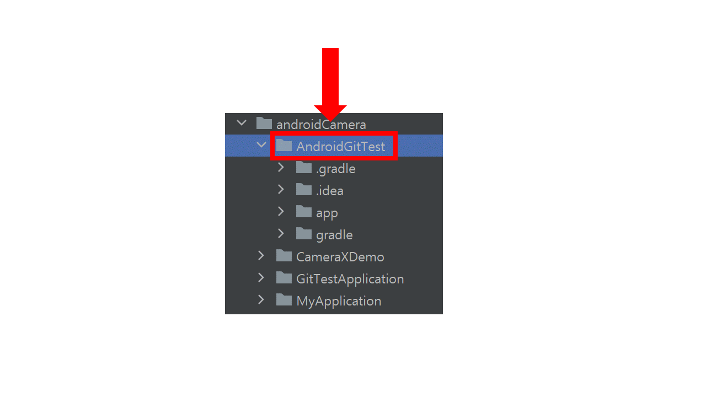

## How to use Github 첫 페이지로 [이동](./index.md)

---
## 목차
1. [Git 설치하기](#git-설치하기)
1. [Base Project 만들기](#base-project-만들기)
1. [Clone Project](#clone-project)
1. [[기타] Git 사용시 주의사항](#git-사용시-주의사항)
1. [[기타] Git user 정보 수정하기](#git-user-정보-수정하기)

---
## Git 설치하기

> Android Studio는 Git이 내장되어있지 않기때문에 별도 설치가 필요합니다.  
> Git 설치파일을 [다운로드](https://git-scm.com/) 받아 Next 쭈~~~~~~욱 눌러 설치합니다.

  
  
  
  

---
## Base Project 만들기

> 팀원들과 함께 사용할 Base Project를 새롭게 생성합니다.

  
  

> 프로젝트 명, 패키지 이름을 입력합니다.  
> 패키지 이름 입력시 앱 스토어에 올릴 수 있도록 하려면  
> com.example로 시작하는 기본 패키지를 수정합니다.  
> 저희는 com.smhrd.여러분의 팀명.프로젝트명으로 규칙을 정하겠습니다.

  
  

> 생성된 프로젝트를 팀원들과 공유 할 수 있게 Git이 관리하는 프로젝트로 변경합니다.
> 상단의 VCS > import into Version Control > Create Git Repository 메뉴 선택 후  
> Git이 관리할 프로젝트 폴더를 선택합니다.

  
  
  

> 프로젝트 내부 파일 이름들이 붉은색으로 변경됩니다.  
> app에서 오른쪽 클릭후 Git > Add 메뉴를 선택합니다.  

  

> 파일들이 Git이 관리할 목록으로 올라갔기 때문에 초록색으로 변경됩니다.

  

> 목록에 올라간 파일들을 이력(snapshot)으로 남겨보겠습니다.  
> app에서 오른쪽 클릭후 Git > Commit Directory 메뉴를 선택합니다.  

  

> Commit으로 남길 파일들의 체크박스가 체크되었는지 확인 후 Commit 버튼을 클릭합니다.

  

> Commit 버튼을 클릭하면 Git 정보 입력창이 뜹니다. (기존에 Git을 한번도 쓰지 않은 경우)  
> Github 로그인시 자신의 정보에서 볼 수 있는 사용자 이름과  
> Github 로그인시 사용하는 이메일을 입력합니다.  
> 기존 Git 정보를 수정하고 싶은 경우 [[기타]Git user 정보 수정하기](#Git-user-정보-수정하기)를 참고하세요.

  

  

> 이력을 남긴 프로젝트를 Github에 업로드(push)합니다.  
> app에서 오른쪽 클릭 후 Git > Repository > Push 메뉴를 선택합니다.  

  

> 사전에 만든 Github 저장소 URL을 입력 후, Push 버튼을 클릭합니다.

  

  

> Github 사용자 인증을 위한 메뉴가 뜨면 Use Token 클릭후 Generate 버튼을 누릅니다.

  

> 자동으로 연결되는 Github Token 생성 페이지에서 쓰기 권한을 추가해줍니다.  
> 쓰기 권한 추가 후 하단에 생성 버튼을 클릭합니다.

  

  

> 생성된 Token 문자열을 복사 후 안드로이드 스튜디오에서 사용자 인증 입력창에 넣어줍니다.
> 생성된 Token은 페이지를 벗어나면 더 이상 보여주지 않으니 복사해서 꼭 따로 저장해놓으세요.

  

> Github 저장소를 다시 들어가면 최초 프로젝트가 업로드 완료된게 보입니다.

  

---
## Clone Project

> 나머지 팀원들은 Base Project를 Clone해서 개발을 진행하면됩니다.  
> 상단 메뉴에서 File > New > Project from Version Control을 선택합니다.

  

> Clone할 Github 저장소에서 URL을 복사합니다.

  

> 복사한 URL을 입력합니다. Directory에 자동으로 clone한 프로젝트가 저장 될 폴더가 입력됩니다.  
> 원하시면 다른 폴더를 선택해도 됩니다.

  

---
## Git 사용시 주의사항

1. Git/Github가 익숙하지 않을 때는 팀원끼리 충돌을 피하기 위해 다른 파일을 작업하길 권장합니다.
2. 같은 파일에 기능을 개발해야하는 경우 소스코드를 건드리는 작업 날짜나 시간을 다르게 합니다.
3. Git/Github가 익숙해지면 충돌을 조금씩 경험해봅시다.
4. 인쌤tv [Github 사용법](https://www.youtube.com/watch?v=8gyquB3VNNs) 영상에 충돌 상황 설명이 있으니 참고하세요.
5. 항상 Commit(1번) > Pull(2번) > Push(3번) 우선 순위를 기억하세요.  
6. Pull을 할경우 현재 내 작업물 Commit을 먼저해야합니다.
7. Push를 할경우 Github에서 Pull을 먼저 진행해야 합니다.

---
## Git user 정보 수정하기

> Git 정보를 이전에 입력 했거나 잘못입력해서 변경하고 싶은 경우 Git bash에서 아래 명령어를 입력합니다.  
> Git 설치 폴더로 이동하면 Git bash 프로그램을 실행 할 수 있습니다.

- Git 사용자 정보 확인
  - git config --global user.name
  - git config --global user.email

- 기존의 Git 사용자 정보 삭제
  - git config --global --unset user.name
  - git config --global --unset user.email

- 새로운 Git 사용자 정보 추가 (명령어 쓰지 않고 안드로이드 스튜디오에서 commit시 입력창으로 설정 가능)
  - git config --global user.name "새로운 사용자 이름"
  - git config --global user.email "새로운 이메일"
  
---
