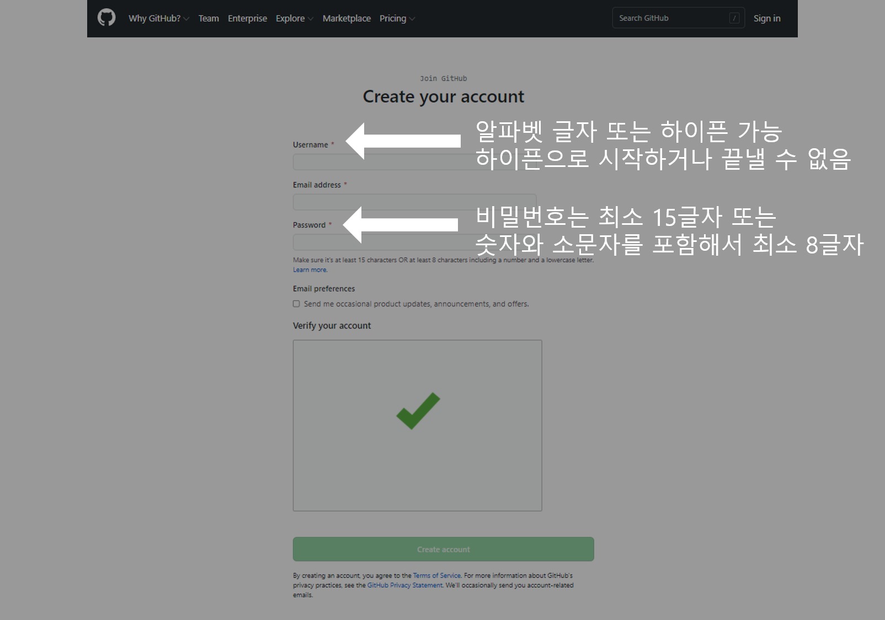
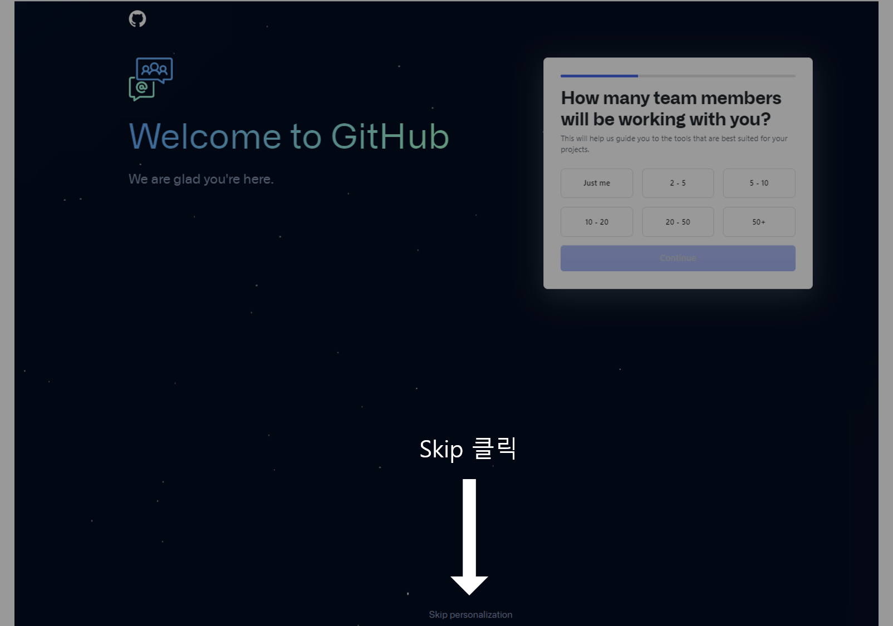
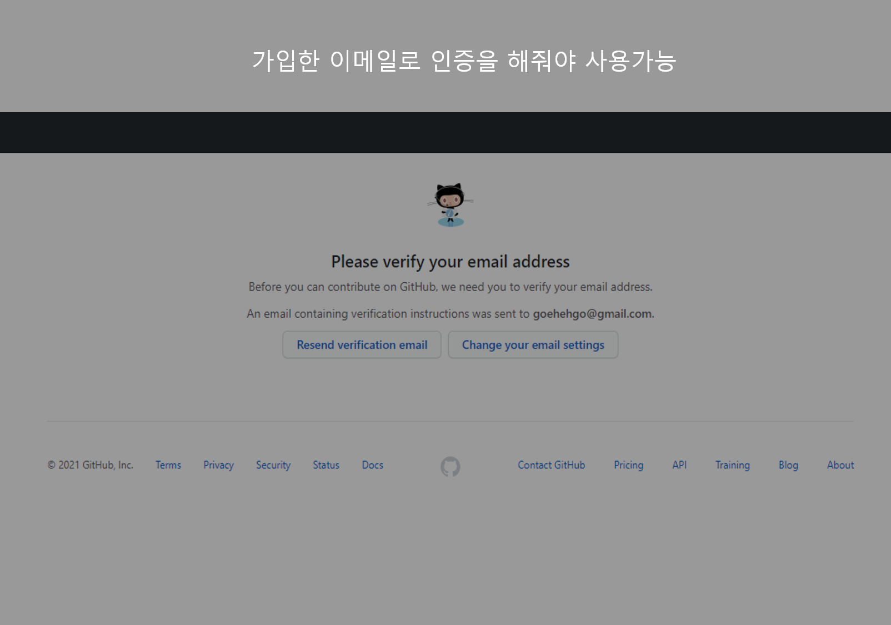
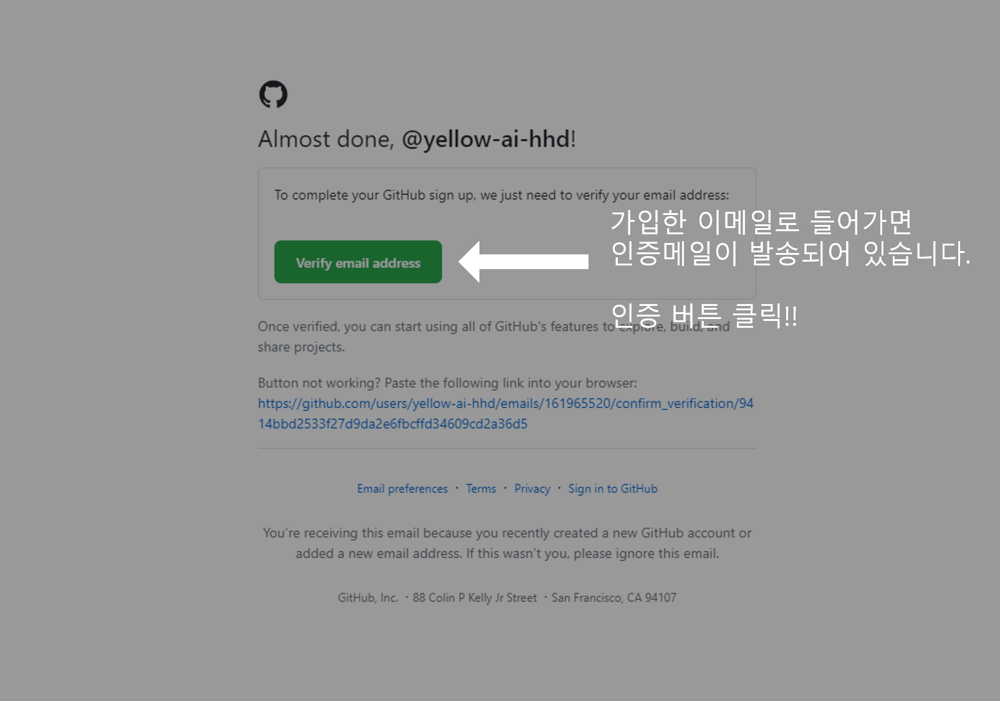
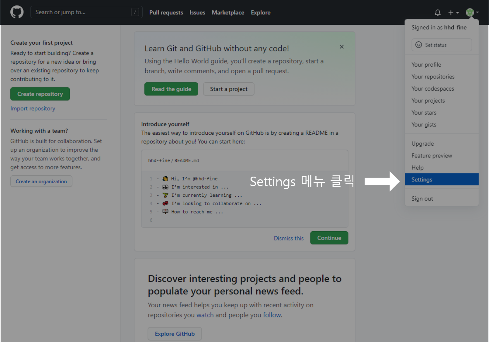
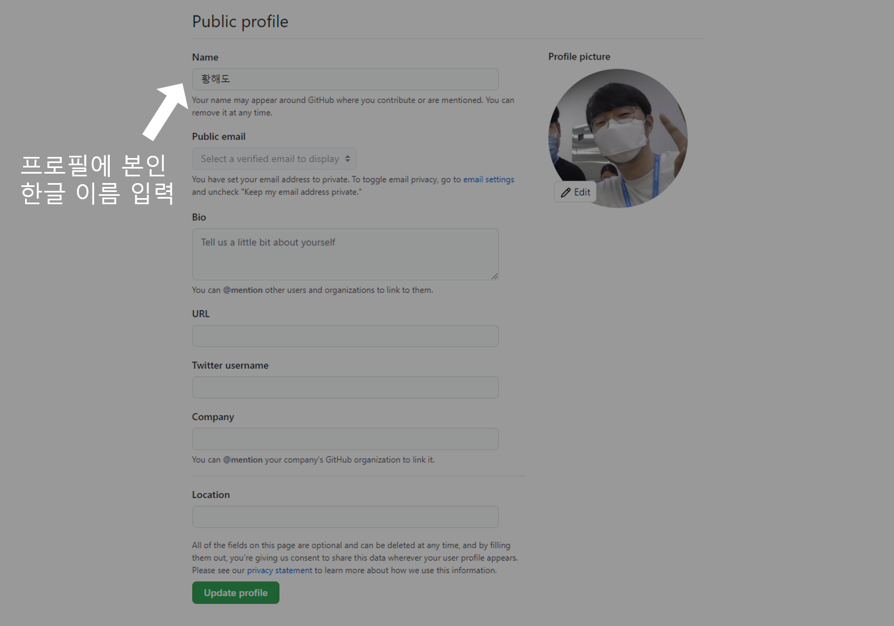

# Git과 Github 이해하기

> 팀 프로젝트의 원활한 진행을 위한 Git과 Github가 무엇인지 알아보고  
> Eclipse를 이용한 간단한 연동 방법도 영상으로 확인해 봅시다!!  

[](https://www.youtube.com/watch?v=3eVZyCWhVKU)  
#01. 능력있는 개발자라면 알아야 할 git, Github(개요)  

[](https://www.youtube.com/watch?v=8HFu9ZwslO8)  
#02. 코드! 버전관리의 끝판왕! Git사용법  

[](https://www.youtube.com/watch?v=8gyquB3VNNs)  
#03. 모르는 개발자가 없는 유용of 최강유용한 GitHub 사용법!  

---

# Github 가입하기

> 실제로 프로젝트를 진행하기 위해 아래 순서를 따라서 Github에 가입해봅시다.  
> Github 사이트로 접속 후 오른쪽 상단의 Sign up 클릭  

  

> 필요한 정보 입력 후 계정 생성 버튼 클릭  



> 저장소 개인 셋팅 Skip~~ 나중에 필요하면 설정해도 됩니다!!  



> Github를 이용하려면 이메일 인증이 필요합니다!! 인증하러 가볼까요!!  



> 가입시 작성했던 이메일로 가보면 인증 메일이 한 개 도착해있습니다.  
> 메일안에 인증 버튼을 클릭하시면 됩니다!!  



> Github 사이트로 이동하면서 인증 성공 메세지가 뜹니다!! 성공!!  


> 여러분이 누구인지 알기 위해서 프로필 이름을 바꾸러 가봅시다!!  
> 셋팅 메뉴로 들어가주세요~!!  



> 본인 한글이름으로 작성해주시고, 필요시 사진도 본인을 어필 할 수 있는 사진으로 바꿔주세요!!  



Text can be **bold**, _italic_, or ~~strikethrough~~.

[Link to another page](./another-page.html).

There should be whitespace between paragraphs.

There should be whitespace between paragraphs. We recommend including a README, or a file with information about your project.

# Header 1

This is a normal paragraph following a header. GitHub is a code hosting platform for version control and collaboration. It lets you and others work together on projects from anywhere.

## Header 2

> This is a blockquote following a header.
>
> When something is important enough, you do it even if the odds are not in your favor.

### Header 3

```js
// Javascript code with syntax highlighting.
var fun = function lang(l) {
  dateformat.i18n = require('./lang/' + l)
  return true;
}
```

```ruby
# Ruby code with syntax highlighting
GitHubPages::Dependencies.gems.each do |gem, version|
  s.add_dependency(gem, "= #{version}")
end
```

#### Header 4

*   This is an unordered list following a header.
*   This is an unordered list following a header.
*   This is an unordered list following a header.

##### Header 5

1.  This is an ordered list following a header.
2.  This is an ordered list following a header.
3.  This is an ordered list following a header.

###### Header 6

| head1        | head two          | three |
|:-------------|:------------------|:------|
| ok           | good swedish fish | nice  |
| out of stock | good and plenty   | nice  |
| ok           | good `oreos`      | hmm   |
| ok           | good `zoute` drop | yumm  |

### There's a horizontal rule below this.

* * *

### Here is an unordered list:

*   Item foo
*   Item bar
*   Item baz
*   Item zip

### And an ordered list:

1.  Item one
1.  Item two
1.  Item three
1.  Item four

### And a nested list:

- level 1 item
  - level 2 item
  - level 2 item
    - level 3 item
    - level 3 item
- level 1 item
  - level 2 item
  - level 2 item
  - level 2 item
- level 1 item
  - level 2 item
  - level 2 item
- level 1 item

### Small image


### Large image


### Definition lists can be used with HTML syntax.

<dl>
<dt>Name</dt>
<dd>Godzilla</dd>
<dt>Born</dt>
<dd>1952</dd>
<dt>Birthplace</dt>
<dd>Japan</dd>
<dt>Color</dt>
<dd>Green</dd>
</dl>

```
Long, single-line code blocks should not wrap. They should horizontally scroll if they are too long. This line should be long enough to demonstrate this.
```

```
The final element.
```
