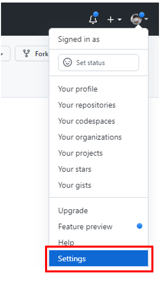
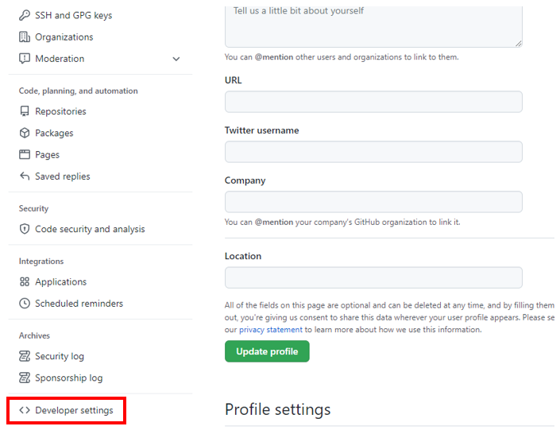
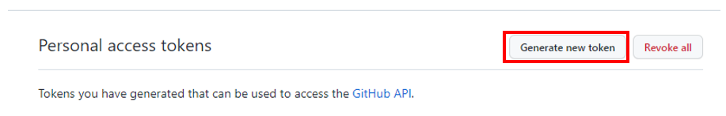
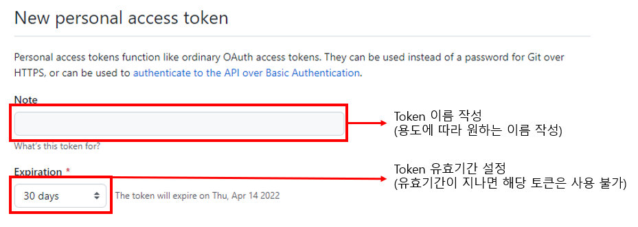
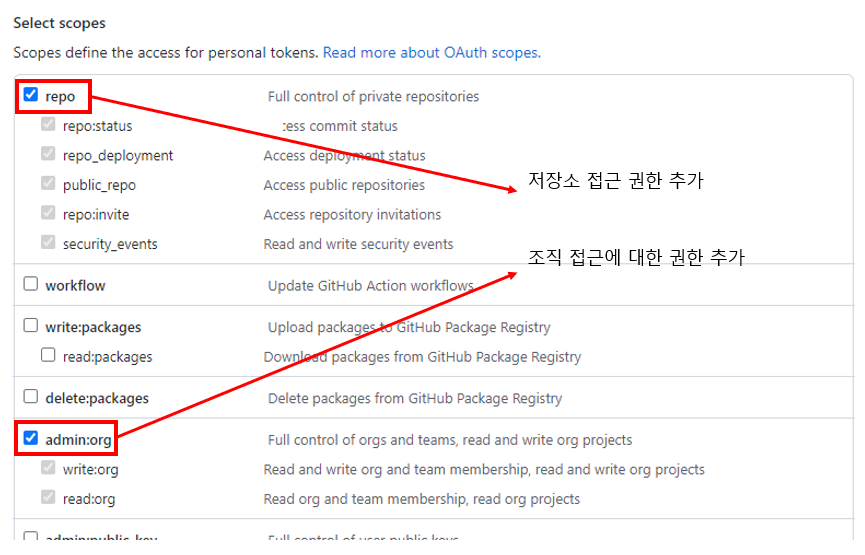

## 변경내역 commit후 push할때 로그인이 안되는 경우(해결방법)

> Github에서 로그인할때 사용하는 비밀번호를 push할때 사용하지 않고 대신 Personal access token을 쓰도록 권장하고 있음  
> 임시 비밀번호처럼 token 문자열을 발급받아 이클립스에서 push할때 사용할 수 있음  

1. 오른쪽 상단에 프로필을 누르고 Settings 메뉴로 진입  
  

2. 왼쪽 메뉴 제일 하단에 Developer settings 메뉴로 진입 후 Personal access tokens 메뉴 선택  
  

3. 새로운 토큰을 생성하기 위해 Generate new token 버튼 클릭  
  

4. 토큰의 이름과 유효기간 설정  
  

5. 토큰으로 가능한 권한 설정  
  

6. 쓰기 권한 추가 후 하단에 생성 버튼을 클릭  
  

7. 생성된 Token 문자열을 복사 후 push할때 로그인 비밀번호 대신에 사용합니다.  
(생성된 Token은 페이지를 벗어나면 더 이상 보여주지 않으니 복사해서 꼭 따로 저장해놓으세요.)  

